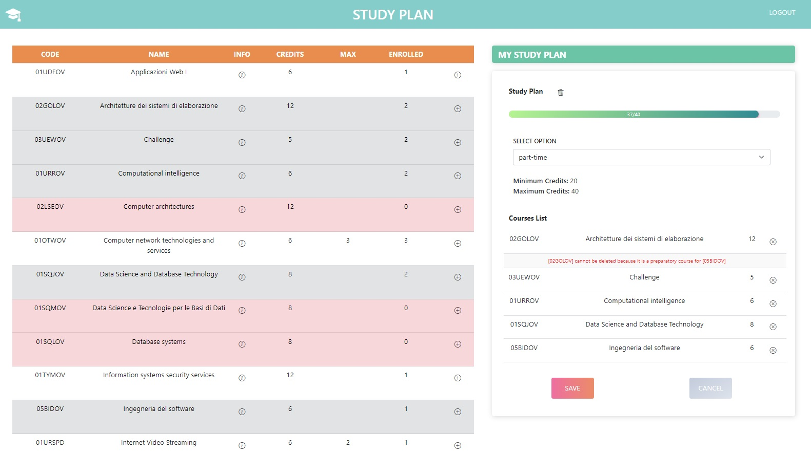

# Exam #1: "StudyPlan"
## Student: s304841 ZHU XIAOZHEN

## React Client Application Routes

- Route ``/``: Welcome Page. Unauthenticated (anonymous) users see all the courses that the
university offers. It is also possible to login by clicking the login button. If logged in, it redirects to the homepage of a logged in user.
- Route `/homepage`: Logged-in users can see the full course list as well as a section where a user can create a study plan if they don't have one yet, or see the empty/filled up study plan. Not logged-in users will be redirected to the `/login` page where they can log in.
- Route `/login`: if logged in, it redirects to the homepage, if not a user can login by filling up the form with email and password

## API Server

#### USER API

##### Create a new session (login)

URL: `/api/sessions`

HTTP Method: POST

Description: Create a new session starting from given credentials.

Request body:
```json
{
  "username": "james.watson@polito.it",
  "password": "password"
}
```

Response: `200 OK` (success) or `500 Internal Server Error` (generic error).

Response body: _None_

##### Get the current session

URL: `/api/sessions/current`

HTTP Method: GET

Description: Verify if the given session is still valid and return the info about the logged-in user. A cookie with a valid session id must be provided.

Request body: _None_

Response: `201 Created` (success) or `401 Unauthorized` (error).

Response body:
```json
{
  "username": "student@studenti.polito.it",
  "id": "1",
  "name": "Student"
}
```

##### Destroy the current session (logout)

URL: `/api/sessions/current`

HTTP Method: DELETE

Description: Delete the current session. A cookie with a valid session id must be provided.

Request body: _None_

Response: `200 OK` (success) or `500 Internal Server Error` (generic error).

Response body: _None_

#### COURSES API

##### List all the courses

URL: `/api/courses`

HTTP Method: GET

Description: Get all the courses.

Request body: _None_

Response: `200 OK` (success) or `500 Internal Server Error` (generic error).

Response body:
```json
[
    {
        "code": "02GOLOV",
        "name": "Architetture dei sistemi di elaborazione",
        "cfu": 12,
        "enrolledStudents": 0,
        "maxStudents": null,
        "incompatibleWith": [
            "02LSEOV"
        ],
        "preparatoryCourse": null
    },
    {
        "code": "02LSEOV",
        "name": "Computer architectures",
        "cfu": 12,
        "enrolledStudents": 0,
        "maxStudents": null,
        "incompatibleWith": [
            "02GOLOV"
        ],
        "preparatoryCourse": null
    },
    {
        "code": "01SQJOV",
        "name": "Data Science and Database Technology",
        "cfu": 8,
        "enrolledStudents": 0,
        "maxStudents": null,
        "incompatibleWith": [
            "01SQMOV",
            "01SQLOV"
        ],
        "preparatoryCourse": null
    },
    {
    "code": "01TXSOV",
    "name": "Web Applications II",
    "cfu": 6,
    "enrolledStudents": 0,
    "maxStudents": null,
    "incompatibleWith": [],
    "preparatoryCourse": "01TXYOV"
    },
    {
        "code": "01NYHOV",
        "name": "System and device programming",
        "cfu": 6,
        "enrolledStudents": 0,
        "maxStudents": 3,
        "incompatibleWith": [
            "02GRSOV"
        ],
        "preparatoryCourse": null
    },
  ...

]
```

##### Get a course by code

URL: `/api/courses/:code`

HTTP Method: GET

Description: Get all the information of the course identified by its code.

Example: `/api/courses/04GSPOV`

Request body: _None_

Response: `200 OK` (success) or `404 Not Found` (course not found) or `422 Unprocessable entity` (validation of course code failed) or `500 Internal Server Error` (generic error).

Response body:
```json
{
    "code": "01NYHOV",
    "name": "System and device programming",
    "cfu": 6,
    "enrolledStudents": 0,
    "maxStudents": 3,
    "incompatibleWith": [
        "02GRSOV"
    ],
    "preparatoryCourse": null
}

```
#### PLAN API

##### Get a Plan by User Id

URL: `/api/plans/:userId`

HTTP Method: GET

Description: Get all the information of a plan identified by its user id.

Example: `/api/plans/5`

Request body: _None_

Response: `200 OK` (success) or `401 Not Authorized` (not authorized to perform the operation) or `404 Not Found` (no plan associated to user id, user does not exist) or `422 Unprocessable entity` (validation of plan id failed) or `500 Internal Server Error` (generic error).

Response body:
```json
{
    "userId": 5,
    "option": "full-time",
    "minCredits": 60,
    "maxCredits": 80,
    "courses": [
        {
            "COURSEID": "01UDFOV",
            "CREDITS": 6,
            "NAME": "Applicazioni Web I",
            "PREPCOURSE": null,
            "conflictCourses": [
                {
                    "CONFLICTCOURSE": "01TXYOV"
                }
            ]
        },
        {
            "COURSEID": "02GOLOV",
            "CREDITS": 12,
            "NAME": "Architetture dei sistemi di elaborazione",
            "PREPCOURSE": null,
            "conflictCourses": [
                {
                    "CONFLICTCOURSE": "02LSEOV"
                }
            ]
        },
        {
            "COURSEID": "03UEWOV",
            "CREDITS": 5,
            "NAME": "Challenge",
            "PREPCOURSE": null,
            "conflictCourses": []
        },
        {
            "COURSEID": "01URROV",
            "CREDITS": 6,
            "NAME": "Computational intelligence",
            "PREPCOURSE": null,
            "conflictCourses": []
        },
        {
            "COURSEID": "01SQJOV",
            "CREDITS": 8,
            "NAME": "Data Science and Database Technology",
            "PREPCOURSE": null,
            "conflictCourses": [
                {
                    "CONFLICTCOURSE": "01SQMOV"
                },
                {
                    "CONFLICTCOURSE": "01SQLOV"
                }
            ]
        },
        {
            "COURSEID": "01TYMOV",
            "CREDITS": 12,
            "NAME": "Information systems security services",
            "PREPCOURSE": null,
            "conflictCourses": [
                {
                    "CONFLICTCOURSE": "01UDUOV"
                }
            ]
        },
        {
            "COURSEID": "05BIDOV",
            "CREDITS": 6,
            "NAME": "Ingegneria del software",
            "PREPCOURSE": "02GOLOV",
            "conflictCourses": [
                {
                    "CONFLICTCOURSE": "04GSPOV"
                }
            ]
        },
        {
            "COURSEID": "01URSPD",
            "CREDITS": 6,
            "NAME": "Internet Video Streaming",
            "PREPCOURSE": null,
            "conflictCourses": []
        }
    ]
}
```
##### Create a new Study Plan

URL: `/api/plan/:userId`

HTTP Method: POST

Description: Create a new empty Study Plan with full-time or part-time option.

Example: `/api/plan/1`

Request body:
```json
{
    "option": "full-time"
}

OR

{
    "option": "part-time"
}
```

Response: `201 Created` (success) or `401 Not authorized` (not authorized to perform the operation) or `404 Not found` (user not found) or `409 Conflict` (user has already created a plan) or `422 Unprocessable Entity` (validation of request body failed) or `503 Service Unavailable` (generic error).

Response body: _None_.

##### Update a Study Plan

URL: `/api/plan/:userId`

HTTP Method: PUT

Description: Update some information of a study plan, e.g. add courses to the plan, modify the study plan option. If the option is not changed, `newOption` will be equal to the old one.

Example: `/api/plan/1`

Request body:
```json
{
  "newOption": "part-time",
  "newCourses": ["01OTWOV", "04GSPOV", "02LSEOV", "01URROV", "03UEWOV"]
}
```

Response: `200 OK` (success) or `401 Not Authorized` (not authorized to do some operations)  or `404 Not Found` (plan not found, one or more selected courses not found) or `422 Unprocessable Entity` (validation of request body failed, number of credits is below minCredits or above maxCredits, conflict between courses, number of selected credits doesn't meet requirements) or `503 Service Unavailable` (generic error) .

Response body: _None_.

##### Delete an existing Study Plan

URL: `/api/plans/:userId`

HTTP Method: DELETE

Description: Delete a study plan given its user_id.

Example: `/api/plan/1`

Request body: _None_.

Response: `204 No Content` (success) or `401 Not Authorized` (not authorized to perform some operations) or `404 Not Found` (plan not found) `422 Unprocessable Entity` or `503 Service Unavailable` (generic error).

Response body: _None_.

## Database Tables

- Table `COURSES` - contains code, name, credits, enrolledstudents, maxstudents, prepcourse of the full list of courses
 contains id, name, email and hash of the password for each admin
- Table `COURSESPERPLAN` - contains for each plan identified by user id one or more courses. Each row has a unique identifier
- Table `INCOMPATIBLE` - contains for each main course in the table one or more conflict courses. Each row has a unique identifier
- Table `PLANS` - contains user id, option, min credits and max credits of a plan. The plan is identified by its user id.
- Table `USERS` -  contains id, name, email and hash of the password and salt for each user

## Main React Components

##### Course
In course folder, there are two files:
* Course.js contains a constructor of the object course with the following parameters:
  * code
  * name
  * credits
  * enrolledStudents (default value is 0)
  * maxStudents (default value is null)
  * incompatibleWith (default value is null)
  * preparatoryCourse (default value is null)

* CourseComponents.js contains all the components regarding the full list of courses:

  * Courses is the wrapper that contains the course table
  * in CourseTable we can find the definition of the table with its thead. For each courses, CourseRow component is called in tbody.
  * CourseRow contains a useEffect which changes the colors (to mark conflict courses and preparatory courses or already added courses) of each row whenever the list of courses in the study plan is changed. It also contains a function addCourse which is used to set the pop over message displayed after an action. CourseRow has two rows: one where it calls CourseData and one optional row which may be visible or hidden and which displays additional info on the course, e.g. conflict/preparatory courses
  * For each row CourseData fills it up with course code, name, an info button, cfu, max students, enrolled students and an add button if in plan edit mode.

##### Plan
In course folder, there are two files:
* Plan.js contains a constructor of the object Plan with the following parameters:
  * userId
  * option
  * minCredits
  * maxCredits
  * courses (default is null)

* PlanComponents.js contains all the components regarding the study plan of a user:
  * Plan is the wrapper that contains create plan view, create plan form view, edit plan view and plan view.
  * CreatePlan contains a button which triggers create plan form.
  * When creating a plan, the form displays info on the options available (part-time/ full-time) and it makes use of PlanFormCreate.
  * PlanFormCreate contains a state option which is changed when the user sets the study plan option. Its default value is full-time.
  * if the user has already created a plan and they're not in editing mode, there's a button delete which allows them to delete the entire plan. EditPlan contains a progress bar which records the number of credits in the plan dynamically. If not in edit mode, information on the plan and a table with its course will be displayed. If in edit mode, a form with select plan option will be displayed as well as add button on the full course list.
  * PlanRow contains the rows of the table displayed in the study plan view, for each row it calls PlanData
  * PlanData fills each row of the table and if in edit mode, a delete button for each added  course is displayed.  
  * Progress contains the components regarding the progress bar

##### Authentication
In AuthComponents.js there's a login form which username and password fields. A user can login by clicking on Login button. On submit, the form will call handleSubmit, which checks the parameters. handleLogin is declared in App.js and it sets loggedIn state to true if the user is authenticated. Otherwise it displays an error message. Logout button in authcomponents calls handleLogout on click.

##### Navbar
In Navbar.js we have a wrapper called NavigationBar, with a NavBrand component that displays a logo, a NavTitle and if logged in a logout button. If not logged in, it will display a user icon which on click redirects to the login page.


## Screenshot



## Users Credentials

Here you can find a list of the users already registered inside the provided database.

| email | password | name | type|
|-------|----------|------|-------|
| john.doe@polito.it |password | John| part-time with courses |
| mario.rossi@polito.it | password | Mario | part-time without courses|
| brooklyn.wright@polito.it | password | Brooklyn| full-time without courses|
| anne.shirley@polito.it | password | Anne| no plan|
| james.watson@polito.it | password | James| full-time with courses|
